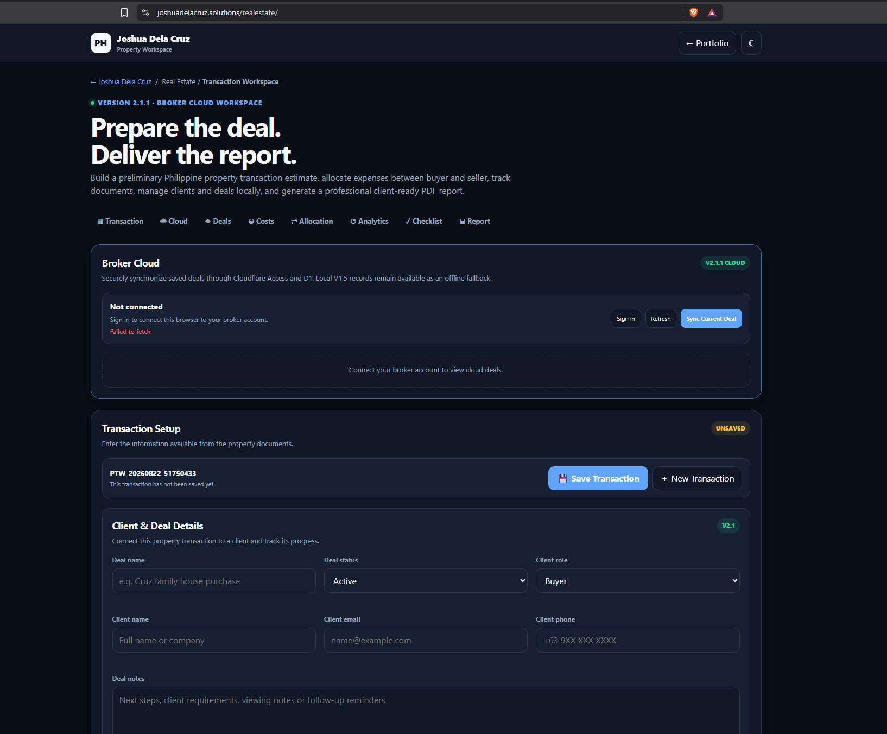

# joshuadelacruz.solutions Portfolio Platform

Source for [joshuadelacruz.solutions](https://joshuadelacruz.solutions), Joshua Dela Cruz's technology portfolio and interactive project hub.



> **Repository role:** This is the deployment source for the main portfolio platform. Standalone applications retain their own repositories, histories, and deployment boundaries.

## Purpose

This repository presents practical evidence for IT support, identity and access operations, application support, cloud operations and software delivery. It combines recruiter-facing case studies, interactive demonstrations and production-backed workspaces without exposing credentials or production data.

## Portfolio areas

- `iam-support/` - IAM case study and interactive automation/human-escalation lab
- `cpp-calculator/` - C++ scientific and programmer calculator case study
- `realestate/` - Philippine property transaction workspace
- `workspaces/` - domain-organized project directory
- `services/` - scoped service packages and inquiry workflow
- `worker/` - Cloudflare Worker routing, security headers and protected APIs
- `migrations/` - Cloudflare D1 database migrations
- `tests/` - Worker, security-policy and page regression tests

## Delivery architecture

```text
GitHub main branch
        |
        v
Cloudflare Workers Builds
        |
        +-- Static portfolio and case studies
        +-- Worker API and security headers
        +-- Cloudflare D1 data services
        |
        v
joshuadelacruz.solutions
```

Linked applications use separate deployment boundaries where appropriate:

- Pi 2048: Rails, PostgreSQL and Docker on Render behind `2048.joshuadelacruz.solutions`
- Scientific Calculator: C++/Drogon container on Render
- Global Malware Trends: C++/Drogon illustrative defensive dashboard on Render

## Security and data boundaries

- Strict browser security headers are applied by the Cloudflare Worker.
- Protected mutations require same-origin requests and verified identity context.
- D1 records are owner-scoped.
- IAM identities, tickets and audit events are fictional and browser-local.
- Malware dashboard data is explicitly illustrative; no malware samples are hosted.
- Secrets and credentials are excluded from the repository.

## Local verification

```text
npm test
```

The command runs:

```text
node --test tests/worker.test.mjs
```

The production deployment is managed through Cloudflare Workers Builds from the `main` branch.

## Related repositories

- [IAM Support Operations Lab](https://github.com/joshua-l-delacruz/iam-support-operations-lab)
- [Pi 2048 Rails App](https://github.com/joshua-l-delacruz/2048-pi-app)
- [C++ Scientific and Programmer Calculator](https://github.com/joshua-l-delacruz/scientific-calculator-cpp)
- [Global Malware Trends C++](https://github.com/joshua-l-delacruz/global-malware-trends-cpp)

## Scope

This is a personal portfolio and sanitized demonstration environment. It does not represent production systems operated for an employer or client.

## Contributing

This is primarily a personal portfolio, but focused bug reports are welcome. See [CONTRIBUTING.md](CONTRIBUTING.md). Do not submit personal data, credentials, client material, or unsolicited changes to biographical content.

## License

No open-source license has been selected yet. Copyright remains with the repository owner unless a license is added.
